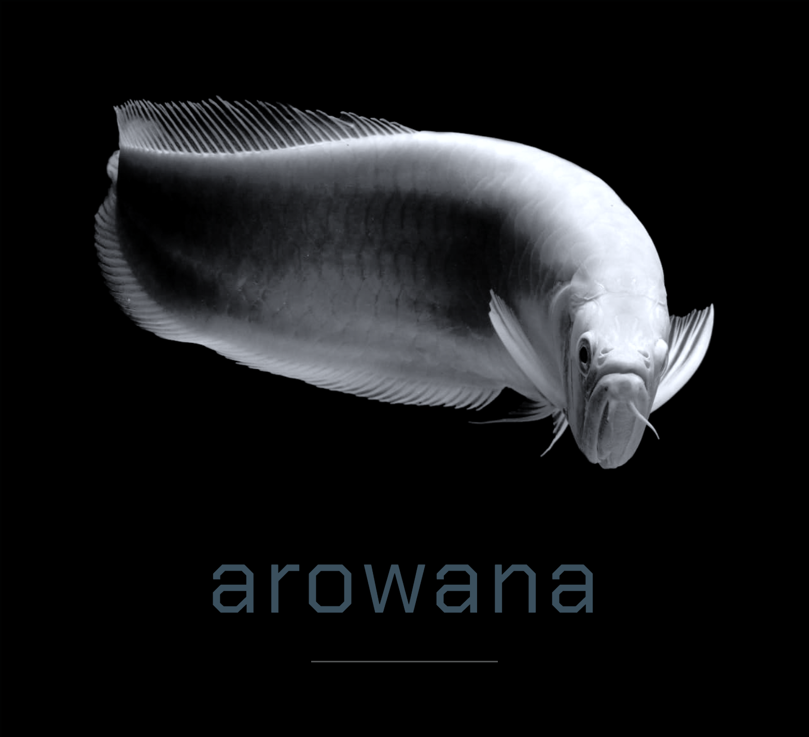

<p align="center"></p>

# Arowana

An interactive git history graph and code reference explorer — one tool, running entirely on your own machine.

## What this is

Two problems that turn out to be the same shape underneath:

- **`git log` is hard to read** across branches — so `gitlog` turns commit history into an actual interactive graph: pan, zoom, click through it.
- **Understanding unfamiliar code is hard** — `grep` finds text, not meaning. `explore` gives you a real graph of what calls what, what implements what, built on actual code analysis: `go/types` directly for Go, the Language Server Protocol (`pyright`, `rust-analyzer`, `clangd`, etc.) for everything else.

Both features share one generic graph engine (`internal/graph`) and one frontend renderer (`GraphView.tsx`), which is what eventually lets them point into each other — click a commit, see the code it touched; click a function, see its whole history (`arowana both`).

Runs locally against your own repo. Nothing gets uploaded anywhere.

## Status

Early — building `explore` first (Go via `go/types`, then other languages via LSP), then `gitlog`, then the merge between them. 

## Getting started

Requires Go 1.26+, Node 24+, [pnpm](https://pnpm.io), and Git.

```bash
git clone https://github.com/Arash1Kazemi/arowana.git
cd arowana
go mod download
cd web && pnpm install && cd ..
go tool lefthook install
```

## Run it (two terminals):

```
make dev-api   # Go server on :8080
make dev-web   # Vite on :5173, proxies /api -> :8080
```

Other useful commands:

```
make test    # Go + frontend tests
make lint    # Go vet + frontend lint
make types   # regenerate TypeScript types from Go structs
make build   # production build
```

## Project structure

```
cmd/arowana/       CLI entry point — dispatches to gitlog, explore, or both
internal/graph/    shared Node/Edge/Graph types both engines populate
internal/gitlog/   git history engine
internal/explore/  code reference engine
web/               React + TypeScript frontend
```
